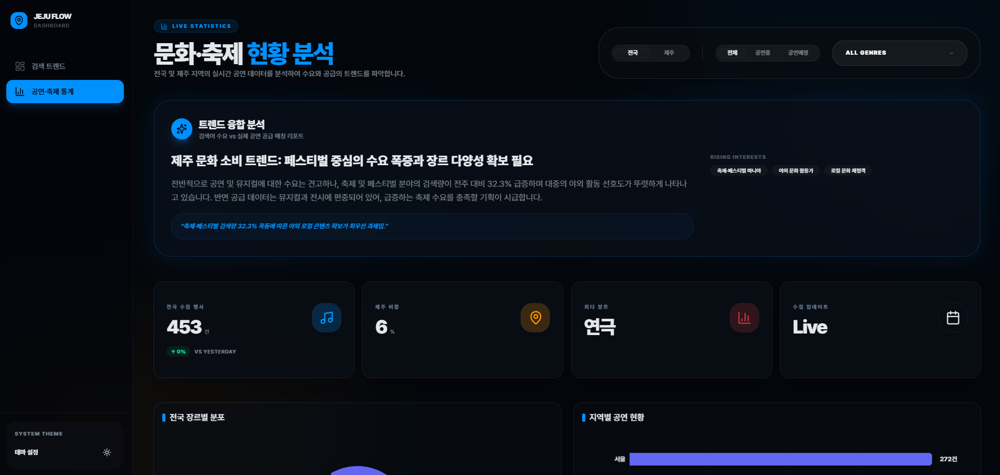
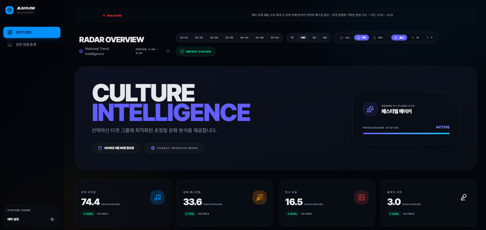
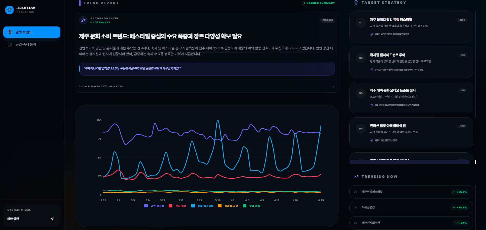
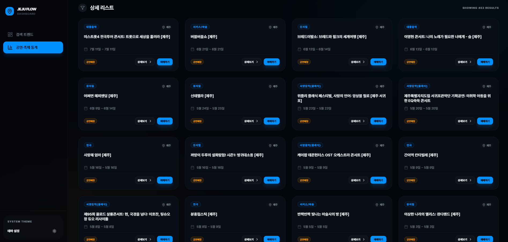
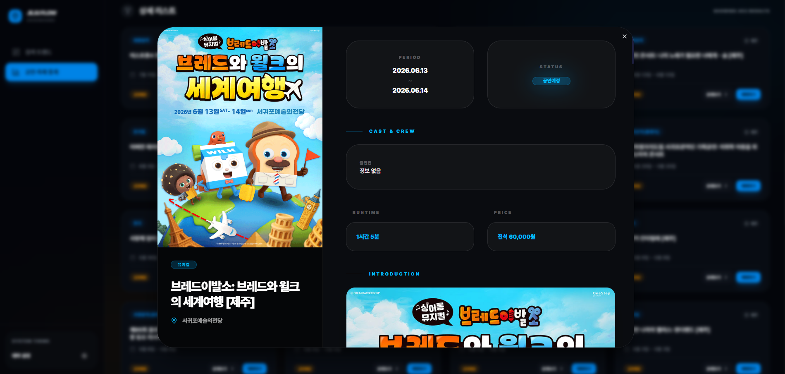

# 🌴 Jeju Flow (제주 문화 트렌드 대시보드)

제주 지역의 문화, 행사, 축제 트렌드를 분석하고 AI 인사이트를 제공하는 **하이엔드 에디토리얼 대시보드**입니다. 네이버 데이터랩(Naver DataLab)의 검색 트렌드 수요와 KOPIS(공연예술통합전산망)의 공급 데이터를 결합하여 제주만의 독특한 문화 인사이트를 추출합니다.

---

## ✨ 주요 기능

### 📈 데이터 기반 트렌드 분석

네이버 데이터랩 API를 활용하여 제주 문화 관련 주요 키워드(공연, 축제, 전시 등)의 검색량 변화 추이를 추적하고 시각화합니다.

### 🤖 AI 인사이트 자동 생성

수집된 검색 트렌드와 공연 데이터를 바탕으로 **Google Gemini AI**가 수요-공급 격차를 분석하고 창의적인 문화 행사 기획 아이디어를 제안합니다.

### 🎭 공연/축제 정보 심층 동기화

KOPIS API를 연동하여 제주 지역의 최신 공연 정보, 장르별 분포, 상세 포스터 및 가격 정보를 실시간으로 수집하고 아카이빙합니다.

---

## 🛠 기술 스택

- **Framework**: Next.js 16 (App Router)
- **AI**: Google Gemini API (`@google/genai`)
- **Database**: Supabase (PostgreSQL)
- **Styling**: Tailwind CSS 4, shadcn/ui, Framer Motion
- **Data APIs**: 네이버 DataLab API, KOPIS API
- **Deployment**: Vercel (Cron Jobs 자동화)

---

## 📦 상세 기획 및 가이드
프로젝트의 더 자세한 기획 내용(유저 페르소나, 기능 명세, 설계 의도 등)은 아래 문서에서 확인하실 수 있습니다.

> 📄 **[프로젝트 상세 기획서 바로가기](./docs/PROJECT_GUIDE.md)**

---

## ⚙️ 설치 및 실행 방법

1. **환경변수 설정**: `.env.local` 파일에 API 키 등록 (README 하단 참고)
2. **패키지 설치**: `npm install`
3. **서버 실행**: `npm run dev`
4. **접속**: `http://localhost:3000`

---

## 📊 데이터 수집 자동화
매일 아침 6시(KST), GitHub Actions를 통해 최신 트렌드와 공연 정보를 수집하고 AI 분석을 자동으로 수행합니다. (`.github/workflows/collect-data.yml`)

---

## 📝 출처 표기
- 검색 트렌드: **네이버 데이터랩(Naver DataLab)**
- 공연 정보: **(재)예술경영지원센터 공연예술통합전산망 (KOPIS)**

---
> 이 프로젝트는 제주 문화 행사 기획자를 위한 실용적인 도구이자, 하이엔드 웹 기술력을 보여주는 포트폴리오 프로젝트로 개발되었습니다.
